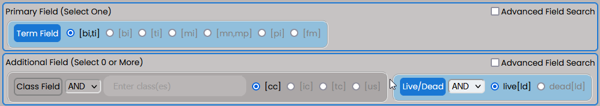
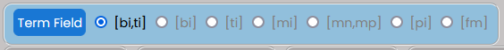
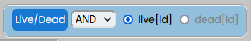
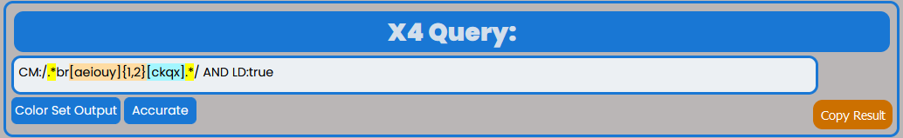
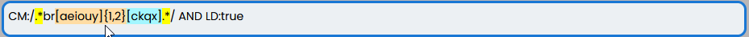

Interface
=========

.. image:: ../_static/BRS-Interface.png

The BRS Translator interface is intended to be an intuitive tool that will provide features and settings that will help users translate common X-Search queries in BRS to the new regular Expression Syntax.  The Interface is has two main components: 

 1. :ref:`BRS Input and Settings`
 
 2. :ref:`Regex Pattern Output and Settings`

BRS Input and Settings
----------------------
.. image:: ../_static/BRS-BRS-SetSection.png

The BRS Input and Settings are on the top of the Application Interface within the blue outline below the "BRS Translator" banner.  This section allows the user to select their BRS query settings based on the type of BRS query they want to perform.  The BRS Translator is currently capable of translating specific field types and queries and is not intended to be a complete translation tool for all BRS query types.

It can handle pattern matching queries intended for the Basic Index [BI], Translation Index [TI], Mark Index [MI], Pseudo Mark Index[PI] using Truncation Operators (i.e., $, $n, ?, and *) and Pattern Matching by class (e.g., {V:2} or {D2:4}) or particular characters (e.g., {"szc"0:2} or {"ckqx"}).  This requires the Term Field to be selected.

It can handle queries for Mark Non-Puncutated Index [MN] and Mark Punctuated Index [MP] but pattern matching does not work with these indices and the input should be reflective of that rule to have a proper translation.

It can also handle disclaimer searches by utilizing quotes in the input field (e.g., "INC." or "BUTTON MAKER").

Finally, any query built can be limited by both the Live Dead Field Selector and the Class Field (as long as the Field Input has a value).

Enter BRS Input
^^^^^^^^^^^^^^^
.. image:: ../_static/BRS-InputSection.png

Users should click on the Input next to "Enter BRS" and enter their BRS query.  The user input will automatically activate the BRS Autopopulate Display to the right of the Input based on the selected BRS Fields below the input and will also autopopulate the Regex Pattern Output as shown here:

.. image:: ../_static/BRSInput.gif

Field Settings
^^^^^^^^^^^^^^

Users can easily configure the appropriate BRS search query using the buttons to activate the desired fields using a Primary Field and optional Additional Field(s).  The Enter BRS Input section is what the Primary Field defines and the user may select only one Primary Field  The default setting is to find BRS pattern matching using the Term Field's Basic Index and Translation Index [bi,ti].  However, the user may click on the **Advanced Field Search** checkbox to display additional options for the Primary Field.  Selecting one of the Advanced Field Search options will automatically deselect the default option.   The default Additional Fiels is set to all live marks with the "Live/Dead" Field on the operator "AND" and the "live[ld]" button set to active; however, users can configure the query to any active set the interface allows.  Active Fields are indicated by the light blue background around the selection and a blue Field button. 

.. note:: 

All of the text input Fields will automatically handle complex search statements with parentheses, quotes, operators and wildcards.  Outer parentheses are not needed for a combination statement and will be automatically indicated by the display in the input once the input contains a space between two sets of consecutive characters.

Primary Fields
""""""""""""""

**Term Field** - This field button will deselect any other Primary Field automatically if it is selected.  
Only one Term Field index may be selected at a time, and the selection will automatically update the BRS Autopopulate Display and the Regex Pattern Output according to the selection.  

The following indices are available:

 **[bi,ti]** - Basic and Translation Indices
 
 **[bi]** - Basic Index
 
 **[ti]** - Translation Index
 
 **[mi]** - Mark Index
 
 **[mn]** - Mark Non-Punctuated Index
 
 **[mp]** - Mark Punctuated Index
 
 **[pi]** - Pseudo Mark Index

**Disclaimer [ds] Field** - This field button will deselect any other Primary Field selected automatically when activated, and activating any other Primary Field will automatically deselect the disclaimer field.  The disclaimer field/index [ds] does not use pattern matching in BRS, but can use wildcards *, ? and $ and can utilize quotes, so you should input the quotes in the BRS Input if you wish to query multiple terms separated by space in your Regex Pattern.  

.. image:: ../_static/BRS-DSSection.png

This demonstrates how the BRS Translator operates to handle the quoted input in the Regex Pattern Output when the disclaimer field is chosen:

.. image:: ../_static/BRS-DSField.gif

**Design Code [dc] Field** - This field button will deselect any other Primary Field selected automatically when activated, and activating any other Primary Field will automatically deselect the design code field.  The Design Code [dc] Field does not use pattern matching in BRS, but can use wildcards *, ? and $.  

**G/S [gs] Field** - This goods/services field button will deselect any other Primary Field selected automatically when activated, and activating any other Primary Field will automatically deselect the goods/services field.  The goods/services [gs] field does not use pattern matching in BRS, but can use wildcards *, ? and $ and can utilize quotes, so you should input the quotes in the BRS Input if you wish to query multiple terms separated by space in your Regex Pattern.  

.. image:: ../_static/BRS-GSSection.png

.. note::

There is an Additional Field selection that you can use to limit a primary field that has its own input in the AdditionaL Field section of the Interface.

**Status Field** - This Status Field button will deselect any other Primary Field selected automatically when activated, and activating any other Primary Field will automatically deselect the Status Field.  The Status Field indices do not use pattern matching in BRS, but can use wildcards *, ? and $ and can utilize quotes, so you should input the quotes in the BRS Input if you wish to query multiple terms separated by space in your Regex Pattern.  

.. image:: ../_static/BRS-StatusFieldSection.png

The following indices are available:

 **[sn]** - Serial Number Index (8 digits)
 
 **[rn]** - Registration Number Index (7 digits)
 
 **[rg]** - Register Index (one of 4 values - "Principal", "Principal-2(f)", "Principal-2(f)-in part", and "Supplemental") 

**Filer Field** - This Filer Field button will deselect any other Primary Field selected automatically when activated, and activating any other Primary Field will automatically deselect the Filer Field.  The Filer Field indices do not use pattern matching in BRS, but can use wildcards *, ? and $ and can utilize quotes, so you should input the quotes in the BRS Input if you wish to query multiple terms separated by space in your Regex Pattern.  

The following indices are available:

 **[on]** - Owner Name Index
 
 **[ow]** - Owner Name and Address Index
 
 **[at]** - Attorney of Record Index 

Additional Fields
"""""""""""""""""

All Additional Fields contain an Operator drop-down selection next to the Field button, which is default "AND", but can be changed to "OR" or "NOT" depending on the user's preference.  Both the BRS Autopopulate Display and Regex X4 Query output will change based on the selected operator.

**Class Field** - This field provides a Class Input where the user can specificy the particular class number(s) and/or letter(s) they wish to search and the specific Class Field Index. 
 

Uppercase or lowercase may be used for non-digit classes.
 
 **Class Input** - This will not create any output in either the BRS Autopopulate Display or the Regex Patter Output until there is some value in the input field.  Outer parentheses are not needed for a combination statement and will be automatically indicated by the display in the input once the input contains a space between two sets of consecutive characters.
 
.. note::
 The user may add parentheses or operators in the input for multiple classes.  BRS Translator will automatically handle creating the appropriate grouping and syntax from this input.

The following indices may be chosen:

 **[cc]** - Coordinated Class Index
 
 **[ic]** - International Class Index
 
 **[tc]** - Trademark Search Facility Classification Code Index
 
 **[us]** - US Class Index

The Class Input and selected index will also provide a warning if the input is invalid, as follows:  

This will not prevent the user from entering invalid Class Input and the BRS Autopopulate Display and Regex Pattern Output from updating.  

**Live Dead Field** - This field is has two options following the operator: **live[ld]** and **dead[ld]**.  This setting is default selected to "AND live[ld]" (i.e., will retrieve only live results). 

**G/S Field** - This field provides a G/S Input where the user can specify particular good(s) and/or service(s).  When selected the query will retrieve only live results.  When it is not selected it will return both live and dead results.

 **G/S Input** - This will not create any output in either the BRS Autopopulate Display or the Regex Patter Output until there is some value in the input field.  
 
.. note::
 The user may add wildcards and quotes in the input and may also add parentheses and operators for multiple goods/services.  BRS Translator will automatically handle creating the appropriate grouping and syntax from this input.  Outer parentheses are not needed for a combination statement and will be automatically indicated by the display in the input once the input contains a space between two sets of consecutive characters.

BRS Autopopulate Display
^^^^^^^^^^^^^^^^^^^^^^^^
.. image:: ../_static/BRS-AutopopSection.png

Next to the BRS Input box you will see the selected fields in the BRS Input and Settings section autopopulate the BRS syntax so that the user does not have to type it into the Input box.  This autopopulated text has a light blue highlight corresponding to the selected fields and completes the BRS query that is translated in the X4 Query Settings and Output Section.  This autopopulated text will change as soon as the user changes the settings but changing the selected settings does not reset the input as shown:  

.. image:: ../_static/BRSAutopop.gif

X4 Query Output and Settings
---------------------------------

X4 Query Output
^^^^^^^^^^^^^^^^^^^^

The X4 Query Output is the main Output display for the BRS Translator application and the exact syntax that can be copied into the new X4 application.  This output automatically assesses the BRS input and determines the appropriate way to handle the translation and whether to apply RegEx.  The application is set to apply RegEx to any BRS search statement that contains pattern matching or wildcards.  

.. note:: 

 Whatever is shown in this display is what will be copied if you hit the "Copy Result" button, except any highlighting. 

.. warning::

 The BRS Translator does not provide errors if the X4 Query Output is problematic or not appropriate for the new X4 application.

Color Set Output Toggle
^^^^^^^^^^^^^^^^^^^^^^^
.. image:: ../_static/BRS-ColorSetOutputSection.png
The Color Set Output is used to show how the syntax is combined to make arguments similar to BRS.  In the example below the Color Set Output demonstrates that the regular expression for 1 to 2 instances of a vowel (i.e., '{v:2}' in BRS) is represented by the orange highlight around '[aeiouy]{1,2}' and that the regular expression for 1 to 2 instances of 's' or 'z' (i.e., '{"sz":2} in BRS) is represented by the blue highlight around '[sz]{1,2}'.  The user may toggle the Color Set Output Toggle by clicking on the button as follows:

.. image:: ../_static/ColorSetOutput.gif

Regex Syntax Toggle
^^^^^^^^^^^^^^^^^^^

The user may also toggle between different regular expression syntax queries to demonstrate a different way to pattern match not possible in BRS.  The Regex Syntax Toggle Button Indicates the current type of regular expression syntax displayed.  The "Accurate" state is a completely analogous translation to the BRS query syntax, while the "Broader" state is a demonstration of the '+' (i.e., 1 or more instances) and '*' (i.e., 0 or more instances) quantifiers in regular expressions that do not have equivalents in BRS but are powerful to avoid specific quantity limitations.  This demonstrates the how the toggle works:

.. image:: ../_static/RegExSyntaxTog.gif

Copy Result Button
^^^^^^^^^^^^^^^^^^

The user can click on the "Copy Result" button and the Regex Pattern Output will be copied to the computer's clipboard.  You may paste (Ctrl+V) the Regex Pattern Output into the new search application.
