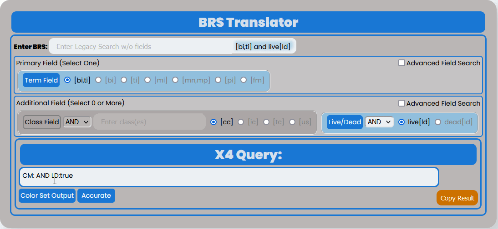
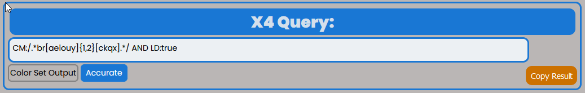

Interface
=========

.. image:: ../_static/BRS-Interface.png

The BRS Translator interface is intended to be an intuitive tool that will provide features and settings that will help users translate common X-Search queries in BRS to the new regular Expression Syntax.  The Interface is has two main components: 
  1. BRS Input and Settings
  2. RegEx Pattern Output and Settings

BRS Input and Settings
----------------------

The BRS Input and Settings are on the top of the Application Interface within the blue outline below the "BRS Translator" banner.  This section allows the user to select their BRS query settings based on the type of BRS query they want to perform.  The BRS Translator is currently capable of translating specific field types and queries and is not intended to be a complete translation tool for all BRS query types.

It can handle pattern matching queries intended for the Basic Index [BI], Translation Index [TI], Mark Index [MI], Pseudo Mark Index[PI] using Truncation Operators (i.e., $, $n, ?, and *) and Pattern Matching by class (e.g., {V:2} or {D2:4}) or particular characters (e.g., {"szc"0:2} or {"ckqx"}).  This requires the Term Field to be selected.

It can handle queries for Mark Non-Puncutated Index [MN] and Mark Punctuated Index [MP] but pattern matching does not work with these indices and the input should be reflective of that rule to have a proper translation.

It can also handle disclaimer searches by utilizing quotes in the input field (e.g., "INC." or "BUTTON MAKER").

Finally, any query built can be limited by both the Live Dead Field Selector and the Class Field (as long as the Field Input has a value).

Enter BRS Input
^^^^^^^^^^^^^^^

Users should click on the Input next to "Enter BRS" and enter their BRS query.  The user input will automatically activate the BRS Autopopulate Display to the right of the Input based on the selected BRS Fields below the input and will also autopopulate the Regex Pattern Output as shown here:

Field Settings
^^^^^^^^^^^^^^

.. image:: ../_static/BRSFieldSettHighlight.png

  Term Field
    [bi,ti]
    [bi]
    [ti]
    [mi]
    [mn]
    [mp]
    [pi]
  Disclaimer Field
  Live Dead Field
  Class Field
    Class Input
    [cc]
    [ic]
    [tc]
    [us]

BRS Autopopulate Display
^^^^^^^^^^^^^^^^^^^^^^^^

Next to the BRS Input box you will see the selected fields in the BRS Input and Settings section autopopulate the BRS syntax so that the user does not have to type it into the Input box.  This autopopulated text completes the BRS query that is translated in the Regex Pattern Settings and Output Section.  This autopopulated text will change as soon as the user changes the settings but changing the selected settings does not reset the input as shown:

.. image:: ../_static/BRSAutopop.gif

Regex Pattern Output and Settings
---------------------------------
.. image:: ../_static/BRS-RegexPatSection.png
Regex Pattern Output
^^^^^^^^^^^^^^^^^^^^

Color Set Output Toggle
^^^^^^^^^^^^^^^^^^^^^^^

The Color Set Output is used to show how the syntax is combined to make arguments similar to BRS.  In the example below the Color Set Output demonstrates that the regular expression for 1 to 2 instances of a vowel (i.e., '{v:2}' in BRS) is represented by the orange highlight around '[aeiouy]{1,2}' and that the regular expression for 1 to 2 instances of 's' or 'z' (i.e., '{"sz":2} in BRS) is represented by the blue highlight around '[sz]{1,2}'.  The user may toggle the Color Set Output Toggle by clicking on the button as follows:

.. image:: ../_static/ColorSetOutput.gif

Regex Syntax Toggle
^^^^^^^^^^^^^^^^^^^
.. image:: ../_static/BRSSynTogHighlight.png

The user may also toggle between different regular expression syntax queries to demonstrate a different way to pattern match not possible in BRS.  The Regex Syntax Toggle Button Indicates the current type of regular expression syntax displayed.  The "Accurate" state is a completely analogous translation to the BRS query syntax, while the "Broader" state is a demonstration of the '+' (i.e., 1 or more instances) and '*' (i.e., 0 or more instances) quantifiers in regular expressions that do not have equivalents in BRS but are powerful to avoid specific quantity limitations.  This demonstrates the how the toggle works:

Copy Result Button
^^^^^^^^^^^^^^^^^^

