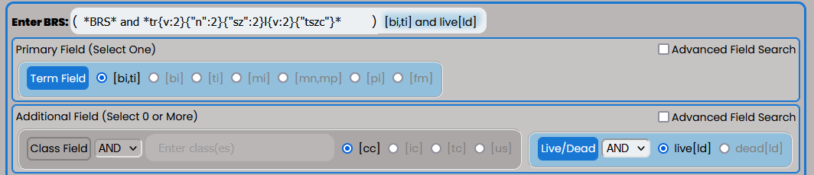
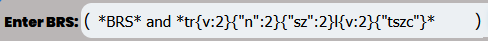
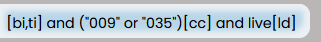

Interface
=========

.. image:: ../_static/BRS-Interface.png

The BRS Translator interface is intended to be an intuitive tool that will provide features and settings that will help users translate common X-Search queries in BRS to the new regular Expression Syntax.  The Interface is has two main components: 

 **1. :ref:`brs-input` **
 
 **2. RegEx Pattern Output and Settings**

.. _brs-input:

BRS Input and Settings
----------------------

The BRS Input and Settings are on the top of the Application Interface within the blue outline below the "BRS Translator" banner.  This section allows the user to select their BRS query settings based on the type of BRS query they want to perform.  The BRS Translator is currently capable of translating specific field types and queries and is not intended to be a complete translation tool for all BRS query types.

It can handle pattern matching queries intended for the Basic Index [BI], Translation Index [TI], Mark Index [MI], Pseudo Mark Index[PI] using Truncation Operators (i.e., $, $n, ?, and *) and Pattern Matching by class (e.g., {V:2} or {D2:4}) or particular characters (e.g., {"szc"0:2} or {"ckqx"}).  This requires the Term Field to be selected.

It can handle queries for Mark Non-Puncutated Index [MN] and Mark Punctuated Index [MP] but pattern matching does not work with these indices and the input should be reflective of that rule to have a proper translation.

It can also handle disclaimer searches by utilizing quotes in the input field (e.g., "INC." or "BUTTON MAKER").

Finally, any query built can be limited by both the Live Dead Field Selector and the Class Field (as long as the Field Input has a value).

Enter BRS Input
^^^^^^^^^^^^^^^

Users should click on the Input next to "Enter BRS" and enter their BRS query.  The user input will automatically activate the BRS Autopopulate Display to the right of the Input based on the selected BRS Fields below the input and will also autopopulate the Regex Pattern Output as shown here:

.. image:: ../_static/BRSInput.gif

Field Settings
^^^^^^^^^^^^^^

.. image:: ../_static/BRS-FieldSetSection.png

Users can easily configure the appropriate BRS search query using the buttons to activate the desired fields.  The default setting is to find BRS pattern matching using the Term Field's Basic Index and Translation Index [bi,ti] and all live marks with the "not dead[ld]" button set to active; however, users can configure the query to any active set the interface allows.

**Term Field** - This field button will deselect the "[ds]" button automatically if it is selected.  
Only one Term Field index may be selected at a time, and the selection will automatically update the BRS Autopopulate Display and the Regex Pattern Output according to the selection.  

.. image:: ../_static/BRS-TermFieldSection.png

The following indices are available:

 **[bi,ti]** - Basic and Translation Indices
 
 **[bi]** - Basic Index
 
 **[ti]** - Translation Index
 
 **[mi]** - Mark Index
 
 **[mn]** - Mark Non-Punctuated Index
 
 **[mp]** - Mark Punctuated Index
 
 **[pi]** - Pseudo Mark Index

**Disclaimer Field** - This field button will deselect the "Term Field" automatically when activated, and activating the "Term Field" will automatically deselect the disclaimer field.  The disclaimer field/index [ds] does not use pattern matching in BRS and utilizes quotes, so you should input the quotes in the BRS Input around the term(s) you wish to query in your Regex Pattern.  

This demonstrates how the BRS Translator operates to handle the quoted input in the Regex Pattern Output when the disclaimer field is chosen:

**Live Dead Field** - This field is displayed as a "not dead[ld]" button.  This setting is default selected.  When selected the query will retrieve only live results.  When it is not selected it will return both live and dead results.

.. image:: ../_static/BRS-LiveDeadFieldSection.png

**Class Field** - This field will expand when selected and display a Class Input where the user can specificy the particular class number(s) and/or letter(s) they wish to search and the specific Class Field Index. 
 
.. image:: ../_static/BRS-ClassFieldSection.png

Uppercase or lowercase may be used for non-digit classes.
 
 **Class Input** - This will not create any output in either the BRS Autopopulate Display or the Regex Patter Output until there is some value in the input field.  
 
The user should not add parentheses or operators and should enter the particular class or classes separated by a space (if there is more than one).  BRS Translator will automatically handle creating the appropriate grouping and syntax from this input.

 **[cc]** - Coordinated Class Index
 
 **[ic]** - International Class Index
 
 **[tc]** - Trademark Search Facility Classification Code Index
 
 **[us]** - US Class Index

BRS Autopopulate Display
^^^^^^^^^^^^^^^^^^^^^^^^

Next to the BRS Input box you will see the selected fields in the BRS Input and Settings section autopopulate the BRS syntax so that the user does not have to type it into the Input box.  This autopopulated text completes the BRS query that is translated in the Regex Pattern Settings and Output Section.  This autopopulated text will change as soon as the user changes the settings but changing the selected settings does not reset the input as shown:

.. image:: ../_static/BRSAutopop.gif

Regex Pattern Output and Settings
---------------------------------
.. image:: ../_static/BRS-RegexPatSection.png

Regex Pattern Output
^^^^^^^^^^^^^^^^^^^^
.. image:: ../_static/BRS-RegexPatOutputSection.png

The Regex Pattern Output is the main Output display for the BRS Translator application and the exact syntax that can be copied into the new Search application.  

NOTE: Whatever is shown in this display is what will be copied if you hit the "Copy Result" button, except any highlighting. 

WARNING: The BRS Translator does not provide errors if the Regex Pattern Output is problematic or not appropriate for the new Search application.

Color Set Output Toggle
^^^^^^^^^^^^^^^^^^^^^^^

The Color Set Output is used to show how the syntax is combined to make arguments similar to BRS.  In the example below the Color Set Output demonstrates that the regular expression for 1 to 2 instances of a vowel (i.e., '{v:2}' in BRS) is represented by the orange highlight around '[aeiouy]{1,2}' and that the regular expression for 1 to 2 instances of 's' or 'z' (i.e., '{"sz":2} in BRS) is represented by the blue highlight around '[sz]{1,2}'.  The user may toggle the Color Set Output Toggle by clicking on the button as follows:

Regex Syntax Toggle
^^^^^^^^^^^^^^^^^^^
.. image:: ../_static/BRS-RegexSynTogSection.gif

The user may also toggle between different regular expression syntax queries to demonstrate a different way to pattern match not possible in BRS.  The Regex Syntax Toggle Button Indicates the current type of regular expression syntax displayed.  The "Accurate" state is a completely analogous translation to the BRS query syntax, while the "Broader" state is a demonstration of the '+' (i.e., 1 or more instances) and '*' (i.e., 0 or more instances) quantifiers in regular expressions that do not have equivalents in BRS but are powerful to avoid specific quantity limitations.  This demonstrates the how the toggle works:

.. image:: ../_static/RegExSyntaxTog.gif

Copy Result Button
^^^^^^^^^^^^^^^^^^
.. image:: ../_static/BRS-CopySection.png

The user can click on the "Copy Result" button and the Regex Pattern Output will be copied to the computer's clipboard.  You may paste (Ctrl+V) the Regex Pattern Output into the new search application.
