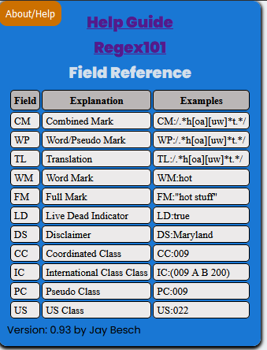

Reference and Help
==================

.. _Help:

About/Help Button 
-----------------

On the top left margin, the BRS Translator has an "About/Help" button that will toggle a display that contains three essential references.

Link to Help Guide
^^^^^^^^^^^^^^^^^^

A link to this documentation.

Link to Elasticsearch Regex Rules
^^^^^^^^^^^^^^^^^^^^^^^^^^^^^^^^^

A link to the Elasticsearch Regex Rules which provides an overview of the syntax for understanding the Elasticsearch version of regular expressions (i.e., Elasticsearch does not adopt all of Perl Compatible Regular Expressions).  

.. note:: 
  Elasticsearch Regex Rules link does not provide any guidance on how to utilize the fields that new Search application will utilize.

Field Reference
^^^^^^^^^^^^^^^

The Field Reference displays a table of the new Search application fields, including the field syntax, the full name of the field, and an example of the syntax appropriate for that field.  These are just the fields that the BRS Translator will produce in the Regex Pattern Output, and does not include the entire list that the new Search application will utilize.

.. _RegexRef:

RegexRef Button
---------------
