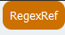
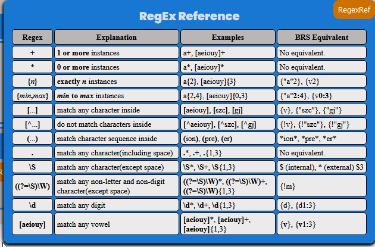

Reference and Help
==================

.. _Help:

About/Help Button 
-----------------

.. image:: ../_static/BRS-AboutHelpButton.png

On the top left margin, the BRS Translator has an "About/Help" button that will toggle a display that contains three essential references.

.. image:: ../_static/BRS-AboutHelpFull.png

Link to Help Guide
^^^^^^^^^^^^^^^^^^

A link to this documentation.

Link to Regex101.com
^^^^^^^^^^^^^^^^^^^^

A link to Regex101.com which is a very useful tool for understanding regular expressions and testing your syntax against character sequences and words.  

NOTE: Regex101.com does not utilize the fields that new Search application will utilize.

Field Reference
^^^^^^^^^^^^^^^

The Field Reference displays a table of the new Search application fields, including the field syntax, the full name of the field, and an example of the syntax appropriate for that field.  These are just the fields that the BRS Translator will produce in the Regex Pattern Output, and does not include the entire list that the new Search application will utilize.

.. _RegexRef:

RegexRef Button
---------------

On the top right margin, the BRS Translator has an "RegexRef" button that will toggle a display that contains regular expression syntax references that may be displayed by the BRS Translator in the Regex Pattern Output.

