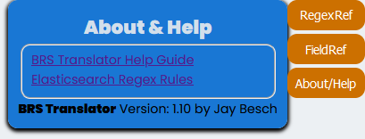

Reference and Help
==================

On the right side of the webpage there are 3 buttons that will expand when selected.  The buttons consist of two interactive reference charts and a display containing useful links to additional resources and this manual.

.. _RegexRef:

RegexRef Button
---------------

.. image:: ../_static/BRS-RegexRefButton.png

On the top right margin, the BRS Translator has an "RegexRef" button that will toggle a display that contains regular expression syntax references that may be displayed by the BRS Translator in the Regex Pattern Output.

.. image:: ../_static/BRS-RegexRefModeFilter.gif

The Regex Reference Has Two Modes and Three Display Filters

Basic-Advanced Modes
^^^^^^^^^^^^^^^^^^^^

**Basic** - This is the default Setting and will display only the essential Regex syntax for equivalence with X-Search's BRS syntax.  This mode is the analagoue to the "Accurate" Regex Output Display and can be used to review the "Accurate" results.

.. image:: ../_static/BRS-RegexRefBasic.png

**Advanced** - This setting provides a more comprehensive list of Regex syntax that can be used for pattern matching in the new Search application.  This mode is the analogue to the "Broader" Regex Output Display and can be used to review the "Broader" results.

.. image:: ../_static/BRS-RegexRefAdv.png

**Filters** - The three filters can be toggled on and off to modify the display of information in the Reference and are all set to on by default.  The filter groups represent the three main types of syntax - Quantifiers, Grouping, and Wildcards.

  **Quantifiers** - Syntax that indicates how many instances of a specific pattern argument to match.  The pattern argument syntax is always first, and is followed by a quantifier (if a quantifier exists). 

  The pattern arument/quantifier set always occurs like this: **[Pattern Argument][Quantifier]**.  For example, the pattern argument/quantifier set **a{1,3}** has **a** as the pattern argument and **{1,3}** as the quantifier - this set will pattern match 1 to 3 instances of the letter "a".   
  
  Where no quantifier exists, the argument is a single instance.  For example, the pattern argument **a** without a quantifier will pattern match exactly one instance of the letter "a".
  
  **Grouping** - Syntax that defines a pattern argument.  The grouping syntax can indicate to match one of a set of characters, to not match one of a set of characters, or match a sequence of characters.  Grouping syntax can also be used to make more complex pattern arguments that consist of several nested arguments.
  
  **Wildcards** - Syntax that defines a pattern argument to match any character other than a space.  Wildcards work just like any other pattern argument in that you can create a pattern argument/quantifier set to designate the amount of instances of the argument you would like to match, or it will match exactly one if no quantifier exists.  In Elasticsearch syntax there is only one wildcard character, the period (or dot as it is commonly refered), **(.)**.  When the dot is used with a quantifier it can emulate all of the X-Search wildcards.

.. _FieldRef:

FieldRef Button
---------------

.. image:: ../_static/BRS-FieldRefModeFilter.gif

The Field Reference Has Two Modes and Six Display Filters.

Common-Detailed Modes
^^^^^^^^^^^^^^^^^^^^^

**Common** - This is the default setting and will display the most common Fields that Examining Attorneys will use in X4 search queries.  The table includes Legacy X-Search Statements and their equivalents in X4 as examples.

**Detailed** - This setting includes more fields that may also be used by Examining Attorneys, but does not include the comprehensive list of Fields in the X4 system.

**Filters** -  The six filters can be toggled on and off to modify the display of information in the Reference and are all set to on by default.  The filter groups represent categories of fields based on the data they retrieve.

 **Term** - These fields relate to the mark in the record, including translations, pseudo-marks, and full marks.
 
 **Drawing** - These fields relate to the drawing and drawing description.
 
 **Status** - These fields relate to the assigned Serial Number, Registration Number, Register, and Live/Dead status.
 
 **Distinct** - These fields relate to distinctiveness considerations.
 
 **ID Class** - These fields relate to the identification of goods/services and classes.
 
 **Filer** - These fields relate to the owner of the mark and the attorney of record.

.. _Help:

About/Help Button 
-----------------

.. image:: ../_static/BRS-AboutHelpButton.png

On the top left margin, the BRS Translator has an "About/Help" button that will toggle a display that contains three essential references.

Link to Help Guide
^^^^^^^^^^^^^^^^^^

A link to this documentation.

Link to Elasticsearch Regex Rules
^^^^^^^^^^^^^^^^^^^^^^^^^^^^^^^^^

A link to the Elasticsearch Regex Rules which provides an overview of the syntax for understanding the Elasticsearch version of regular expressions (i.e., Elasticsearch does not adopt all of Perl Compatible Regular Expressions).  

.. note:: 
  Elasticsearch Regex Rules link does not provide any guidance on how to utilize the fields that new Search application will utilize.
